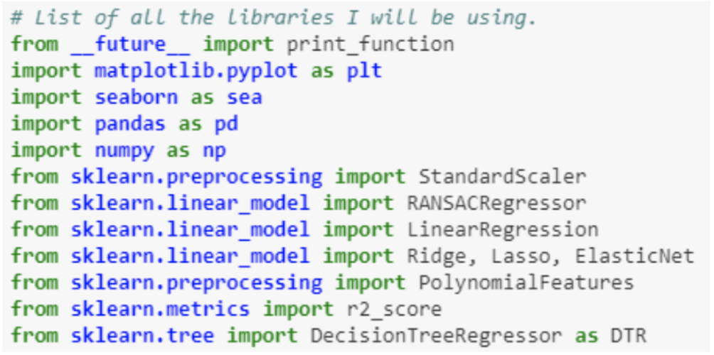

## Research
This page contains all my research projects developed during my PhD at the Alan Turing Institute/University of Leeds Institute for Data Analytics. My past work at King's College London can be found on my [github](https://github.com/SedarOlmez94) and papers including my dissertation at [academia](https://kcl.academia.edu/SedarOlmez).

### Agent Based Model 21/09/2018


[__Click here for repository__](https://github.com/SedarOlmez94/programming_for_social_sciences/tree/working_copy)


I participated in the module titled: __Programming for Social Science: Core Skills GEOG5995M__ at the Leeds Institute for Data Analytics (LIDA) where I developed an agent based model using python with an external library __matplotlib__ and __Atom__ IDE. Two versions of the software was developed a __core__ version and __poacher edition__:


- Core: The core model contains two __.py__ source code files, one is the __Agent__ object (__agentframework.py__) the other __core_code_v1.py__ (main). The model simulates an environment which contains grass (each pixel coloured green) and sheep agents that roam and consume grass, sheep that are within the __neighbourhood__ distance share food. The variables are initialised within the script to unique values:
```
num_of_iterations = 200 # How many iterations should the simulation loop.
num_of_agents = 10 # How many sheep agents should appear.
Neighbourhood = 10 # What is the neighbourhood distance for sharing.
```
  The variables above can be changed before run-time to produce different results, but given these variable initialisations, we
  Get something like this:


<p align="center">
  
</p>

- Poacher edition: I decided to add new features to the simulation. I wrote a new script called __core_code_v2.py__ which is the main that uses the same object __agentframework.py__ but this time we have a __poacher__ agent which shoots sheep that are in close proximity to it (I'm definitely against poaching, this was just a fun experiment). The script now takes an extra value (poacher_neighbourhood) and these values are initialised in the terminal to execute the script using the __sys__ library. 
```
num_of_iterations = int(sys.argv[1])
num_of_agents = int(sys.argv[2])
Neighbourhood = int(sys.argv[3])
Poacher_neighbourhood = int(sys.argv[4]) #The fourth argument, the minimum distance a sheep needs to be to a poacher for it to shoot.
```
The script is executed as such:

(Note: the terminal screenshot was taken before name changes, so the script is actually called core_code_v2.py and not core_code.py, poacher kill range is the poacher_neighbourhood).


The __poacher edition__ is demonstrated below:


<p align="center">
  
</p>


### Linear regression with gradient descent 13/11/2018


[__Click here for repository__](https://github.com/SedarOlmez94/coursework_2_LIDA)


The second piece of coursework for the module __Programming for Social Science: Core Skills GEOG5995M__ required us to develop our own software model which had to:

- Read in some data.
- Process it in some way.
- Display the results.
- Write the results to a file.

My software model was developed in Python but written in Jupyter Notebook so all the results are available in the notebook .ipynb file. To execute the script, you must first:
```
1. Change directory to the same directory as Linear regression.ipynb
2. Type the command: jupyter notebook "Linear regression.ipynb"
```

Here are the important links:
- [Linear Regression.ipynb](https://github.com/SedarOlmez94/coursework_2_LIDA/blob/master/Linear%20regression.ipynb)
- [PDF report](https://github.com/SedarOlmez94/coursework_2_LIDA/blob/master/simple-linear-regression.pdf)
- [UML use case diagram](https://github.com/SedarOlmez94/coursework_2_LIDA/blob/master/UML%20usecase%20diagram.png)

The libraries used in my project are as follows:
<p align="center">
  
</p>


### Data Modelling of Global Bike Sharing 09/02/2019


[__Click here for repository__](https://github.com/Urban-Analytics/SmartSocialCity/tree/master/Machine%20Learning/Bike%20Sharing%20Project)

The libraries required to execute the `data_modelling_bike_sharing_global.ipynb` script are:
```
1. matplotlib
2. numpy
3. scikit
4. IPython
5. seaborn
6. pandas
7. zlib
```

The `data_modelling_bike_sharing_global.ipynb` notebook file can be executed in a conda environment, to create one read the guide here [Virtual Environment](https://uoa-eresearch.github.io/eresearch-cookbook/recipe/2014/11/20/conda/).

The Jupyter notebook can be found here: [notebook](https://github.com/Urban-Analytics/SmartSocialCity/blob/master/Machine%20Learning/Bike%20Sharing%20Project/data_modelling_bike_sharing_global.ipynb)

A static HTML version can be found here: [html notebook](https://github.com/Urban-Analytics/SmartSocialCity/blob/master/Machine%20Learning/Bike%20Sharing%20Project/data_modelling_bike_sharing_global.html)

The code has been fully commented and documented for reference. 


### N20 crop growth data analysis using machine learning methods 26/03/2019


[](https://notebooks.azure.com/solmez/projects/n20-data-analysis)
(Note, the reason I had to use cloud computing was due to the size of the dataset.)


The libraries required to execute the `N20_DATA_ANALYSIS.ipynb` script are already installed on the Azure cluster used to host the notebook via `requirements.txt`


I was provided with a complex dataset containing information about crop growth, I developed some machine learning methods to analyse the specific dataset and gain some insights as to how N20 is effected by various elments captured.


### Modelling the supply and demand of UK Police Forces, an Agent Based Modelling approach 03/04/2019


(Note, this project is ongoing. All information regarding the project can be found on its website: [Turing page](https://www.turing.ac.uk/research/research-projects/computational-models-police-demand-dynamics))


To execute the model, you must 
- Install `Netlogo` version `6.0.4`, you can install it here: [Netlogo](https://ccl.northwestern.edu/netlogo/download.shtml).
- Download the map dataset: [dataset](https://github.com/SedarOlmez94/police_simulation_project-PSP-/tree/master/project/data)


1) The algorithm developed (Pseudocode):
```
calculate T for all forces
crime occurs somewhere CRIME_LOCATION

1- create list M (array) with all resources with time-to-mobilise <= resources_requirement_cycles
2- delete from M all forces where not(minimise_impact) = 0 (no resources of resource to be used i.e. A in this case)

3- loop untill units_required = 0 or resources_requirement_cycles = 0:

4- 	find in M resource with min(time-to-mobilise) "smallest time to mobilise" AND max(M(not(minimise_impact))) = 1A "maximum 
5-  value of the resource which is not the one to minimise_impact on stored in M" 

6- 	(new list object) X = [1A] (add "1A to X")

7- 	if for all resources in X there exists a time-to-mobilise = 0 then subtract 
8- 		resource with time-to-mobilise = 0 from units_required
	
9- 	if units_required <= 0 then [print "crime prevented"
10- 	print names of all forces resources pulled and amount of resources pulled. BREAK]

11- 	subtract 1 from all resources time-to-mobilise in X

12- 	M = M - 1A remove the force added to X from the list M.
```


2) A run of the system:
<p align="center">
  
</p>


(1)


`setup` - load the GIS data into the agent based model software.


`go` - run one iteration of the model.


`watch crime` - view a crime.


`reset perspective` - focus on the entire map not a single crime.


(2)


The two views on the left `units of resource required for crime 1/2` presents the number of resources (each force region in which an incident resides) required to diffuse the incident.


On the right, the number of resources pulled given the timeframe to diffuse each incident.


(3)


These buttons allow the user to move around the map.


(4)


`print dataset` - prints the dataset on the terminal.


`print labels` - prints the labels of the dataset (column names) on the temrinal.


3) The terminal output of the model:
```
Minimise impact on: B for incident 1 and for incident 2: A
All the resources we can use for incident 1: [13 107 25 20 1 12 6 10 77 7 22 19 5 6 1 19 1 1 21 1 5 20 11 3 57 19 7 5 5 5 10 3 57 6] and all their times to mobilise [7 7 0 0 8 3 0 0 1 4 2 1 0 1 2 0 0 7 8 5 4 1 6 8 0 0 5 1 6 5 7 7 4 4 7]
All the resources we can use for incident 2: [24 21 47 5 66 9 1 56 19 13 75 125 1 6 18 34 10 102 7 78 1 82 7 5 5 16 3 5 19 48 42 1 57 36] and all their times to mobilise [4 7 8 8 1 4 0 7 4 5 0 7 5 1 0 1 3 7 2 1 8 7 0 6 4 0 6 0 1 0 5 7 0 2 0]
crime_units_required_1: 110
crime_units_required_2: 160
FOR INCIDENT 1 RESOURCE TO SUBTRACT: 6 FROM POLICE FORCE: 2 TIME IT TAKES FOR RESOURCES TO REACH DESTINATION: 25.870481592667748
FOR INCIDENT 2 RESOURCE TO SUBTRACT: 5 FROM POLICE FORCE: 39 TIME IT TAKES FOR RESOURCES TO REACH DESTINATION: 14.60555127546399
X: [-1 -1]
observer: [-1 -1]
CRIME_UNITS: 104
crime_units_required_1: 104
crime_units_required_2: 155
FOR INCIDENT 1 RESOURCE TO SUBTRACT: 19 FROM POLICE FORCE: 5 TIME IT TAKES FOR RESOURCES TO REACH DESTINATION: 27.328452233468916
FOR INCIDENT 2 RESOURCE TO SUBTRACT: 47 FROM POLICE FORCE: 40 TIME IT TAKES FOR RESOURCES TO REACH DESTINATION: 18.605551275463988
X: [0 0 -1 -1]
observer: [0 0 -1 -1]
CRIME_UNITS: 85
crime_units_required_1: 85
crime_units_required_2: 108
FOR INCIDENT 1 RESOURCE TO SUBTRACT: 5 FROM POLICE FORCE: 21 TIME IT TAKES FOR RESOURCES TO REACH DESTINATION: 22.373380211096357
FOR INCIDENT 2 RESOURCE TO SUBTRACT: 13 FROM POLICE FORCE: 6 TIME IT TAKES FOR RESOURCES TO REACH DESTINATION: 18.39834563766817
X: [1 1 0 0 -1 -1]
observer: [1 1 0 0 -1 -1]
CRIME_UNITS: 80
crime_units_required_1: 80
crime_units_required_2: 95
FOR INCIDENT 1 RESOURCE TO SUBTRACT: 5 FROM POLICE FORCE: 1 TIME IT TAKES FOR RESOURCES TO REACH DESTINATION: 7.82842712474619
FOR INCIDENT 2 RESOURCE TO SUBTRACT: 5 FROM POLICE FORCE: 1 TIME IT TAKES FOR RESOURCES TO REACH DESTINATION: 7.82842712474619
X: [2 2 1 1 0 0 -1 -1]
observer: [2 2 1 1 0 0 -1 -1]
CRIME_UNITS: 75
crime_units_required_1: 75
crime_units_required_2: 90
FOR INCIDENT 1 RESOURCE TO SUBTRACT: 6 FROM POLICE FORCE: 42 TIME IT TAKES FOR RESOURCES TO REACH DESTINATION: 22.609448188596147
FOR INCIDENT 2 RESOURCE TO SUBTRACT: 5 FROM POLICE FORCE: 16 TIME IT TAKES FOR RESOURCES TO REACH DESTINATION: 20.364084996010927
X: [3 3 2 2 1 1 0 0 -1 -1]
observer: [3 3 2 2 1 1 0 0 -1 -1]
CRIME_UNITS: 69
crime_units_required_1: 69
crime_units_required_2: 85
FOR INCIDENT 1 RESOURCE TO SUBTRACT: 10 FROM POLICE FORCE: 29 TIME IT TAKES FOR RESOURCES TO REACH DESTINATION: 24.010469622751657
FOR INCIDENT 2 RESOURCE TO SUBTRACT: 57 FROM POLICE FORCE: 38 TIME IT TAKES FOR RESOURCES TO REACH DESTINATION: 25.9405762185524
X: [4 4 3 3 2 2 1 1 0 0 -1 -1]
observer: [4 4 3 3 2 2 1 1 0 0 -1 -1]
CRIME_UNITS: 59
crime_units_required_1: 59
crime_units_required_2: 28
FOR INCIDENT 1 RESOURCE TO SUBTRACT: 6 FROM POLICE FORCE: 27 TIME IT TAKES FOR RESOURCES TO REACH DESTINATION: 18.697935531433117
FOR INCIDENT 2 RESOURCE TO SUBTRACT: 3 FROM POLICE FORCE: 26 TIME IT TAKES FOR RESOURCES TO REACH DESTINATION: 15.097452068300653
X: [5 5 4 4 3 3 2 2 1 1 0 0 -1 -1]
observer: [5 5 4 4 3 3 2 2 1 1 0 0 -1 -1]
CRIME_UNITS: 53
crime_units_required_1: 53
crime_units_required_2: 25
FOR INCIDENT 1 RESOURCE TO SUBTRACT: 19 FROM POLICE FORCE: 36 TIME IT TAKES FOR RESOURCES TO REACH DESTINATION: 14.255832815336873
FOR INCIDENT 2 RESOURCE TO SUBTRACT: 19 FROM POLICE FORCE: 36 TIME IT TAKES FOR RESOURCES TO REACH DESTINATION: 14.255832815336875
X: [6 6 5 5 4 4 3 3 2 2 1 1 0 0 -1 -1]
observer: [6 6 5 5 4 4 3 3 2 2 1 1 0 0 -1 -1]
CRIME_UNITS: 34
units provided for incident 1: 34 units provided for incident 2: 6
resources requirement cycles for incident 1: 0 resources requirement cycles for incident 2: 0
```
 - First line: The types of resource we want to minimise the impact on (use less of) for incident 1 `B` and for incident 2 `A`.
 - All the `resources` we can use for incident 1 and incident 2 and their `times to mobilise`.
 - Each iteration states the `resource`, the `forces ID` and the `time` it takes for the resource to reach the incident.
 - Each incident had an 8 day `resource_requirement_cycle` as we had 8 iterations of supply and demand. 


### Sales forecasting using deep learning techniques 21/05/2019


[__Click here for repository__](https://github.com/SedarOlmez94/sales-forecasting)

The libraries that need to be downloaded to run the script are:
```
1. matplotlib
2. numpy
3. scikit
5. Seaborn
6. Pandas
7. Scipy
8. Statsmodels
9. Datawig
```

The library Datawig can be found here: https://datawig.readthedocs.io/en/latest/ All of the work is reproducible and can be found in the [predictive_modelling.ipynb](https://github.com/SedarOlmez94/sales-forecasting/blob/master/predictive_modelling.ipynb) notebook. 


### Crime exploration in Greater London using data from police.gov 27/06/2019


[__Click here for report__](http://rpubs.com/sedar_olmez/crime_exploration)

The research questions to be answered were:
* Using police crime records from 2018-05 to 2019-05, can we produce a spatial map of crime type distributions across Greater London and cluster these to gain further insight on how crime evolves over space?
* will this help us distribute the correct type of resources to tackle hot points of specific crime incidences?
* is there a correlation between the drug related incidences and the incidences of anti-social behaviour across London?

#### Executive summary
Crime data provided by Police Forces in London over a 12 month period will be used to produce multiple visualisations of crime type distributions over space and time. Machine Learning techniques, more specifically cluster analysis will then be used on the data to derive the crime type hotspots across London which should aide police resource allocation.

#### References
Dustmann, Christian, and Francesco Fasani. 2016. “The Effect of Local Area Crime on Mental Health.” Economic Journal. https://doi.org/10.1111/ecoj.12205.

Malleson, Nick, and Martin A. Andresen. 2016. “Exploring the impact of ambient population measures on London crime hotspots.” Journal of Criminal Justice. https://doi.org/10.1016/j.jcrimjus.2016.03.002.

Stafford, Mai, Tarani Chandola, and Michael Marmot. 2007. “Association between fear of crime and mental health and physical functioning.” American Journal of Public Health. https://doi.org/10.2105/AJPH.2006.097154.

Sutherland, Alex, Ian Brunton-Smith, and Jonathan Jackson. 2013. “Collective efficacy, deprivation and violence in London.” British Journal of Criminology. https://doi.org/10.1093/bjc/azt050.

Whitley, Rob, and Martin Prince. 2005. “Fear of crime, mobility and mental health in inner-city London, UK.” Social Science and Medicine. https://doi.org/10.1016/j.socscimed.2005.03.044.

